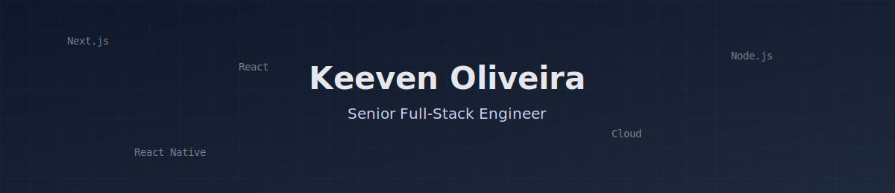

  

## 👋 Hi, I'm Keeven Oliveira

**Senior Full-Stack Engineer** focused on building **scalable, high-performance products** using  
**TypeScript, React / Next.js, Node.js and Cloud architectures**.

I enjoy solving complex problems, improving developer experience, and building software that delivers **real business impact**.

  

---

## 🧭 Quick Navigation

- 🎨 [Frontend Focus](#-frontend-focus)
- ⚙️ [Backend Focus](#️-backend-focus)
- 🚀 [Product & Architecture](#-product--architecture)
- 🧩 [Tech Stack](#-tech-stack)
- ⭐ [Featured Projects](#-featured-projects)

  

### 🎨 Frontend Focus

I work mainly with **React, Next.js and TypeScript**, focusing on:

- Performance, SEO and accessibility
- Scalable component architecture
- Design systems and reusable UI
- Clean, maintainable codebases

---

### ⚙️ Backend Focus

On the backend side, I have solid experience with:

- Node.js (Express / NestJS)
- REST and GraphQL APIs
- Prisma and SQL performance optimization
- Scalable and well-structured architectures

---

### 🚀 Product & Architecture

Beyond code, I care deeply about **product and architecture decisions**, including:

- End-to-end ownership of features
- Cloud and infrastructure decisions
- Performance, scalability and reliability
- Aligning engineering decisions with business goals

---

## 🧩 Tech Stack

### 🎨 Frontend

  
  
  
  
  
  
  

---

### ⚙️ Backend

  
  
  
  
  

---

### 🗄 Databases

  
  
  

---

### ☁️ Cloud & DevOps

  
  
  
  

---

## ⭐ Featured Projects

🚀 <a href="https://www.darwinx.com.br/">**DarwinX**</a> 
Equipment and operations management platform  
**Stack:** React, React Native, Node.js, Next.js, Prisma, MongoDB, PostgreSQL, AWS

🎓 <a href="https://www.sebraeplay.com.br/">**Sebrae Play**</a> 
Educational platform with live events and courses  
**Stack:** React.js, Next.js, Node.js, PostgreSQL, AWS

🗣️ <a href="https://www.lucaidiomas.com/">**Luca Idiomas**</a> 
Online language learning platform with private 1:1 classes  
**Stack:** Next.js, TypeScript, Node.js, MongoDB, AWS

🧠 <a href="https://github.com/KeevenOliveira/Pastey">**Pastey (macOS)**</a> 
Native macOS clipboard manager  
**Stack:** Swift, SwiftUI

---

## 🔗 Links

- 🌐 **Portfolio / Business Card**  
  https://keevenoliveira.com.br/card

- 💼 **LinkedIn**  
  https://www.linkedin.com/in/keeven-oliveira

---

## 🇧🇷 Em Português

Sou **desenvolvedor Full-Stack Sênior**, com foco em **TypeScript, React / Next.js, Node.js e Cloud**.

Atuo no desenvolvimento de produtos escaláveis, APIs bem estruturadas e aplicações com impacto real no negócio.  
Tenho uma visão forte de produto e arquitetura, sempre buscando alinhar decisões técnicas aos objetivos da empresa.

  

